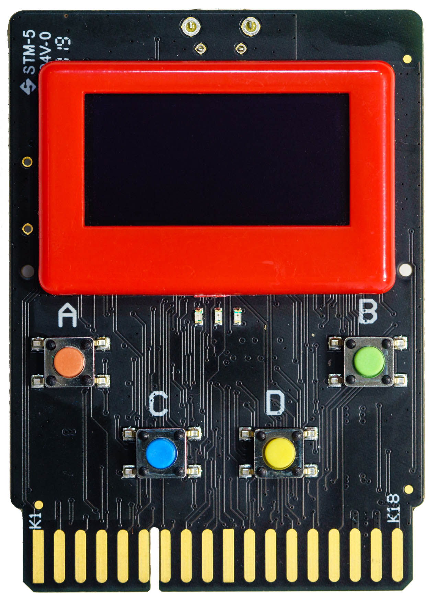
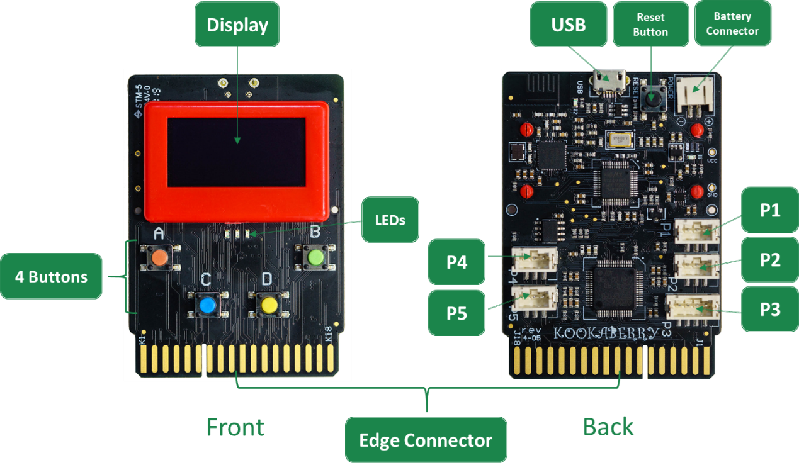

The Kookaberry
==============

The Kookaberry is an easy-to-use micro-computer which was designed in Australia to engage both students and teachers at the basic level of our digital world.

Its primary purpose is to enrich lessons across many Key Learning Areas of the primary curriculum such as Geography, 
Personal Health, Mathematics, Science & Technology; and it can be used in practical learning projects as diverse as weather stations, art installations, 
mathematical games, physical fitness, and musical experimentation.

The Kookaberry is slightly larger than a credit card, and it stands alone in its ability to introduce children to the digital world through measuring, 
monitoring, communicating and displaying data; storing the results for later graphing and analysis; 
and transforming data through algorithms (i.e. coding) to control processes and external devices.

In that context, the Kookaberry uses pre-coded applications with plug-and-play sensors to measure and log data such as temperature, 
humidity, and soil moisture over time; as well as control external elements such as speakers, lights, relays, servos, fans, or water pumps. 
On-board sensors and buttons allow the development of simple educational games and fun activities that work straight out of the box.

--------------------
Physical Arrangement
--------------------

The physical arrangement of the Kookaberry is shown below.

.. _kberrylayout:

   The Kookaberry's physical layout

The principal features are:

1. The User Interface comprising a display, buttons and LEDs
2. Electrical Connectors for supplying power to the Kookaberry, for communications with the Kookaberry, and for the connection of peripherals

User Interface
--------------

The following features provide information and control for the user of the Kookaberry:

1.	Display, located on the front, is monochrome with cyan (light-blue) pixels. It is capable of displaying text and simple line and dot graphics.  
The dimensions of the display are 128 pixels wide by 64 pixels high.

2.	Pushbuttons labelled A, B, C and D.  These are able to be read by scripts on the Kookaberry and their functions are configured by those scripts.

3.	Three LEDs (green, orange, and red) which can be controlled by the Kookaberry scripts.  

4.	Reset Button located on the rear-top of the Kookaberry.  It is used to reset the Kookaberry back to its initial start-up conditions, 
and also to launch the on-board app menu (see later instructions).  It does not reset the hardware to its power-up state. 
The power must be switched off and switched on again to accomplish a full hardware and software reset.

.. _kooka_connectors:

Connectors
----------

The Kookaberry has a range of connectors:

1.	Battery Connector – the battery box plugs in here.  
Battery boxes usually have a power switch and take three or four 1.5-volt AAA or AA batteries. 
As an alternative a USB power pack can be used with the appropriate USB to JST cable.  
It is also possible to connect a 9 Volt battery with an appropriate connecting lead.

.. important:: 
    The total battery supply voltage should not exceed 12.00 Volts into the Battery Connector or damage to the Kookaberry may result.

2.	Micro USB Connector – this plug accepts USB leads that plug into a computer.  
The USB connector provides access by the computer to the Kookaberry’s program memory, and it appears to the computer as a USB memory stick.  
The Kookaberry will also accept power from this connector. 

.. important:: 
    Always dismount the Kookaberry from the computer’s drives or else corruption of the Kookaberry’s program storage memory could result 
    necessitating a reformat and loss of any data on in the Kookaberry’s serial memory.

    Total USB supply voltage should be between 4.7 to 5.1 volts.  Damage may result to the Kookaberry if the USB supplied voltage exceeds 5.1 volts.  
    Also, operation of the Kookaberry may be adversely affected if the USB supplied voltage is less than 4.7 volts.

3.	Five connectors P1 to P5 – these connectors are used for accessories such as sensors and for outputs. 
The function of each connector is controlled by Kookaberry scripts.

4.	Edge Connector – located at the bottom of the Kookaberry board, it plugs into a mating connector on an expansion board 
and makes all of the Kookaberry’s connections available depending on the capabilities of the expansion board.

On-board Facilities
-------------------

The Kookaberry has the following on-board facilities:

1.	Microcomputer, either ARM-based (Advanced Reduced Instruction Set Computer Machine) or a Raspberry Pi RP2040
2.	4 MBytes serial memory (USB accessible)
3.	Monochrome OLED Display 128 x 64 pixels (Organic Light Emitting Diode)
4.	22 GPIO (General Purpose Input-Output) pins
5.	Up to 11 ADC (Analogue to Digital Converters) depending on microcomputer type
6.	2 DAC (Digital to Analogue Converters) on ARM-based microcomputers only (and not on the RP2040 Kookaberry)
7.	Timers and Real Time Clock
8.	Magnetic Compass and Accelerometer
9.	2.4GHz Digital Packet Radio

