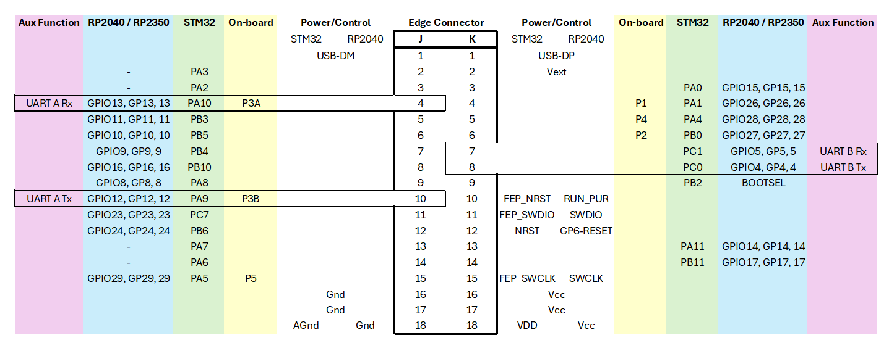

.. currentmodule:: machine

.. _machine.Pin:

Kookaberry GPIO Pins
====================

**Kookaberry** GPIO Pins are allocated and arranged as shown in the diagram below.
As there are two variants of the **Kookaberry** (STM32 and RP2040 / RP2350 microcomputers), the native GPIO nomenclature varies.

A common nomenclature has been established using the names of the on-board connectors (``P1``, ``P2``, ``P3A``, ``P3B``, ``P4``, and ``P5``),
and also the names of the edge-connector contacts (``J1``-``J18``, and ``K1``-``K18`` inclusive). 

Referencing GPIO Pins with their **Kookaberry** common names will ensure scripts will work across both **Kookaberry** models.  

Please note that not as many GPIO Pins are available on the RP2040 / RP2350 variants, and these Pins 
(``J2``, ``J3``, ``J13``, ``J14``) should not be used if scripts are to be fully transportable between **Kookaberry** models.

All GPIO Pins can also be referenced by their native microcomputer names as shown in the columns under STM32 and RP2040 / RP2350, 
but scripts using these names will not run without errors on the other microcomputer.

.. _edge_connector:

   The Kookaberry's GPIO Pin Assignment

See :ref:`kooka_connectors` for a layout of the on-board connectors.

The GPIO Pins available may also be discovered using the **REPL** console interface in **KookaIDE** as follows::

  >>>from machine import Pin

  >>> help(Pin.cpu) # Will list all the GPIO Pins and their aliases for the CPU in use

  >>> help(Pin.board) # Lists all known GPIO Pins at the board level (i.e. the Kookaberry)
                      # Some of these Pins are not accessible by user programs as they may be reserved for internal use

class Pin -- control I/O pins
=============================

A pin object is used to control I/O pins (also known as GPIO - general-purpose
input/output).  Pin objects are commonly associated with a physical pin that can
drive an output voltage and read input voltages.  The pin class has methods to set the mode of
the pin (IN, OUT, etc) and methods to get and set the digital logic level.
For analog control of a pin, see the :class:`ADC` and :class:`DAC` classes.

A pin object is constructed by using an identifier which unambiguously
specifies a certain I/O pin.  The allowed forms of the identifier and the
physical pin that the identifier maps to are specific to the microcomputer model.  Possibilities
for the identifier are an integer, a string or a tuple with port and pin
number.

Usage Model::

    from machine import Pin

    # create an output pin on pin P1
    p1 = Pin("P1", Pin.OUT)

    # set the value low then high
    p1.value(0)
    p1.value(1)

    # create an input pin on pin P2, with a pull up resistor
    p2 = Pin("P2", Pin.IN, Pin.PULL_UP)

    # read and print the pin value
    print(p2.value())

    # reconfigure pin P1 in input mode
    p1.mode(p1.IN)

    # configure an irq callback
    p1.irq(lambda p:print(p))

Pin Constructors
----------------

.. class:: Pin(id, mode=-1, pull=-1, \*, value, alt)

   Access the GPIO pin associated with the given ``id``.  If
   additional arguments are given in the constructor then they are used to initialise
   the pin.  Any settings that are not specified will remain in their previous state.

   The arguments are:

     - ``id`` is mandatory and can be an arbitrary object.  Among possible value
       types are: int (an internal Pin identifier), and str (a Pin name).

     - ``mode`` specifies the pin mode, which can be one of:

       - ``Pin.IN`` - Pin is configured for input.  If viewed as an output the pin
         is in high-impedance state.

       - ``Pin.OUT`` - Pin is configured for (normal) output.

       - ``Pin.OPEN_DRAIN`` - Pin is configured for open-drain output. Open-drain
         output works in the following way: if the output value is set to 0 the pin
         is active at a low level; if the output value is 1 the pin is in a high-impedance
         state.

       - ``Pin.ALT`` - Pin is configured to perform an alternative function.  For a pin configured in such a way any other Pin methods
         (except :meth:`Pin.init`) are not applicable (calling them will lead to undefined,
         or a hardware-specific, result).

     - ``pull`` specifies if the pin has a (weak) pull resistor attached, and can be
       one of:

       - ``None`` - No pull up or down resistor.
       - ``Pin.PULL_UP`` - Pull up resistor enabled.
       - ``Pin.PULL_DOWN`` - Pull down resistor enabled.

     - ``value`` is valid only for Pin.OUT and Pin.OPEN_DRAIN modes and specifies initial
       output pin value if given, otherwise the state of the pin peripheral remains
       unchanged.

     - ``alt`` specifies an alternate function for the pin and the values it can take are
       port dependent.  This argument is valid only for the ``Pin.ALT`` modes.  
       It may be used when a pin supports more than one alternate function.  If only
       one pin alternate function is supported the this argument is not required.

   As specified above, the Pin class allows to set an alternate function for a particular
   pin, but it does not specify any further operations on such a pin.  Pins configured in
   alternate-function mode are usually not used as GPIO but are instead driven by other
   hardware peripherals.  The only operation supported on such a pin is re-initialising,
   by calling the constructor or :meth:`Pin.init` method.  If a pin that is configured in
   alternate-function mode is re-initialised with ``Pin.IN``, ``Pin.OUT``, or
   ``Pin.OPEN_DRAIN``, the alternate function will be removed from the pin.

Pin Methods
-----------

.. method:: Pin.init(mode=-1, pull=-1, \*, value, alt)

   Re-initialise the pin using the given parameters.  Only those arguments that
   are specified will be set.  The rest of the pin peripheral state will remain
   unchanged.  See the constructor documentation for details of the arguments.

   Returns ``None``.

.. method:: Pin.value([x])

   This method allows to set and get the value of the pin, depending on whether
   the argument ``x`` is supplied or not.

   If the argument is omitted then this method gets the digital logic level of
   the pin, returning 0 or 1 corresponding to low and high voltage signals
   respectively.  The behaviour of this method depends on the mode of the pin:

     - ``Pin.IN`` - The method returns the actual input value currently present
       on the pin.
     - ``Pin.OUT`` - The behaviour and return value of the method is undefined.
     - ``Pin.OPEN_DRAIN`` - If the pin is in state '0' then the behaviour and
       return value of the method is undefined.  Otherwise, if the pin is in
       state '1', the method returns the actual input value currently present
       on the pin.

   If the argument is supplied then this method sets the digital logic level of
   the pin.  The argument ``x`` can be anything that converts to a boolean.
   If it converts to ``True``, the pin is set to state '1', otherwise it is set
   to state '0'.  The behaviour of this method depends on the mode of the pin:

     - ``Pin.IN`` - The value is stored in the output buffer for the pin.  The
       pin state does not change, it remains in the high-impedance state.  The
       stored value will become active on the pin as soon as it is changed to
       ``Pin.OUT`` or ``Pin.OPEN_DRAIN`` mode.
     - ``Pin.OUT`` - The output buffer is set to the given value immediately.
     - ``Pin.OPEN_DRAIN`` - If the value is '0' the pin is set to a low voltage
       state.  Otherwise the pin is set to high-impedance state.

   When setting the value this method returns ``None``.

.. method:: Pin.on()

   Set pin to "1" output level.

.. method:: Pin.off()

   Set pin to "0" output level.

.. method:: Pin.irq(handler=None, trigger=(Pin.IRQ_FALLING | Pin.IRQ_RISING), \*, priority=1, wake=None, hard=False)

   Configure an interrupt handler to be called when the trigger source of the
   pin is active.  If the pin mode is ``Pin.IN`` then the trigger source is
   the external value on the pin.  If the pin mode is ``Pin.OUT`` then the
   trigger source is the output buffer of the pin.  Otherwise, if the pin mode
   is ``Pin.OPEN_DRAIN`` then the trigger source is the output buffer for
   state '0' and the external pin value for state '1'.

   The arguments are:

     - ``handler`` is an optional function to be called when the interrupt
       triggers. The handler must take exactly one argument which is the
       ``Pin`` instance.

     - ``trigger`` configures the event which can generate an interrupt.
       Possible values are:

       - ``Pin.IRQ_FALLING`` interrupt on falling edge.
       - ``Pin.IRQ_RISING`` interrupt on rising edge.

       These values can be OR'ed together to trigger on multiple events.

     - ``priority`` sets the priority level of the interrupt.  The values it
       can take are port-specific, but higher values always represent higher
       priorities.

     - ``wake`` selects the power mode in which this interrupt can wake up the
       system.  It can be ``machine.IDLE``, ``machine.SLEEP`` or ``machine.DEEPSLEEP``.
       These values can also be OR'ed together to make a pin generate interrupts in
       more than one power mode.

     - ``hard`` if true a hardware interrupt is used. This reduces the delay
       between the pin change and the handler being called. Hard interrupt
       handlers may not allocate memory.

   This method returns a callback object.

Pin Constants
-------------

The following constants are used to configure the pin objects.  Note that
not all constants are available on all ports.

.. data:: Pin.IN
          Pin.OUT
          Pin.OPEN_DRAIN
          Pin.ALT

   Selects the pin mode.

.. data:: Pin.PULL_UP
          Pin.PULL_DOWN

   Selects whether there is a pull up/down resistor.  Use the value
   ``None`` for no pull.

.. data:: Pin.IRQ_FALLING
          Pin.IRQ_RISING

   Selects the IRQ trigger type.
