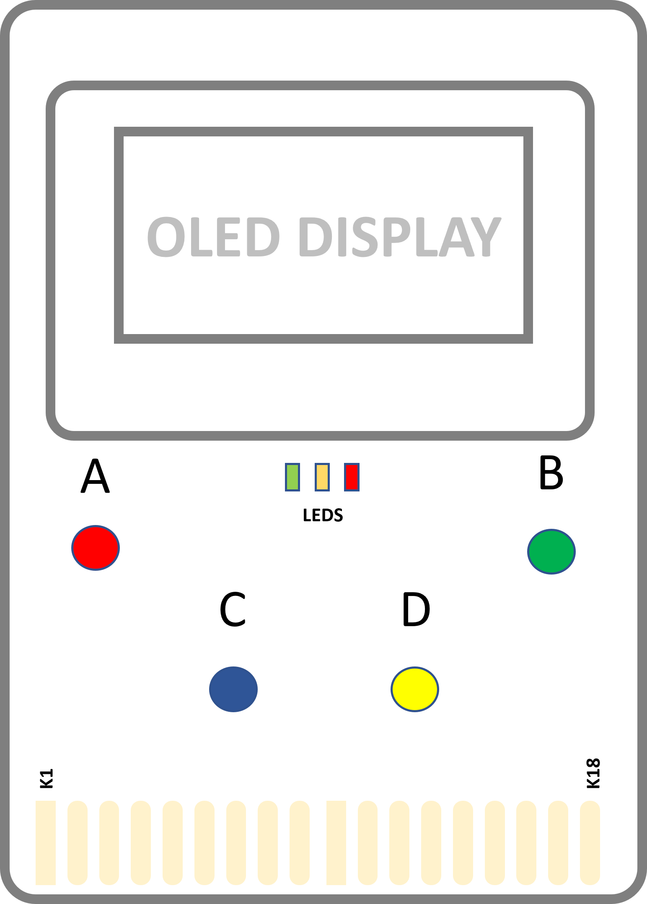
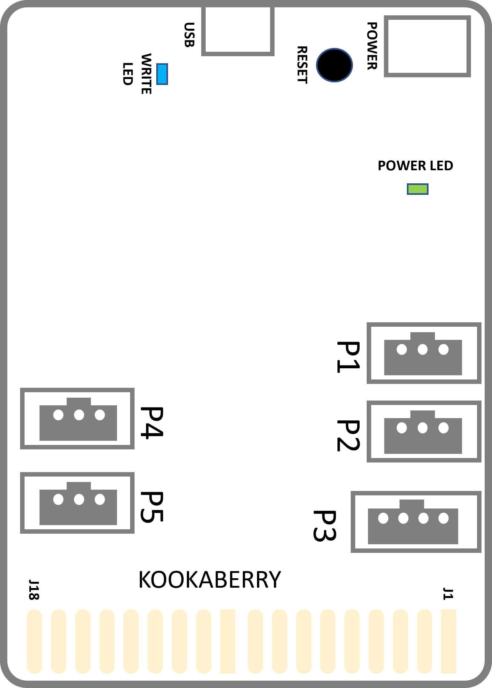

Safety Guide
============

The guidance below will help you to use your **Kookaberry** safely. 

We suggest you retain this information for future reference and share it with your students if you are a teacher.

The **Kookaberry** is an exposed electronics circuit board with all the parts on display so you can see how the electronics are assembled.  
This means there is a small risk that the parts can be damaged by inappropriate handling or use which is beyond the **Kookaberry’s** design tolerances.

.. _kberryfront:

   The Kookaberry's front layout

.. _kberryback:

   The Kookaberry's back layout

Recommended Operating Environment
---------------------------------

* Temperature range: 0 to 40 degrees Centigrade.
* Humidity: 10% to 90% relative humidity.  
* Do not allow the circuit board or any electrically connected item to become wet or to be immersed in any liquid. 
* Do not handle the **Kookaberry** nor any electrical attachments with wet hands. 
* Conversely on days with low humidity, keep away from synthetic fabrics, clothes and carpets as these can store high static electricity charges which will damage the Kookaberry. 

Storage
-------

When not being used, keep the **Kookaberry** in the plastic pouch in which it was supplied.  

This protects against damage from static electricity, and also from physical knocks and scratches.

Power Connection
----------------

The **Kookaberry** may be powered by a compatible battery box supplying from 4.5V DC to 9V DC maximum, 
which is connected to the 2-pin Power connector on the rear of the circuit board to the right of the Reset button. 

Alternatively, power can be supplied from a 5V DC USB-compliant battery pack or computer connection via the USB-C connector at the top-centre of the rear of the circuit board.  Do not power the Kookaberry directly from a USB charger as erroneous operation or damage could occur.

Battery
-------

The Kookaberry is normally supplied with a cylindrical 5-volt rechargeable USB battery pack and a compatible USB-A to USB-C cable.  

The battery pack may be recharged using a USB charger (not supplied).  

* Do not leave the Kookaberry connected to the battery pack when it is being recharged. 
* Do not leave the battery pack on recharge for an extended period after its indicator light has stopped blinking.  
* Do not overload the battery pack as it will overheat and possibly catch alight. 
* Do not leave the battery pack in a hot or wet environment. 
* Cease using the battery pack if it is physically deformed or damaged.  
* Do not puncture the battery pack as the battery within it may catch on fire. 

The battery pack comprises a regulating circuit and a single 18650 3.7V Lithium-Ion battery which is replaceable.  
Dismantling of the battery unit and replacement of the 18650 battery should be performed only by an experienced adult.  

Disposal of the replaced battery should be only through an accredited recycling agent, following their safety procedures.  Lithium-Ion batteries can be dangerous if mis-handled.

Conductive Materials
--------------------

Do not allow metal or any other conductive material to come into contact with the Kookaberry circuit board, 
with the exception of approved connections to the provided plugs and sockets.

Contamination, Shocks and Scratches
-----------------------------------

Handle the Kookaberry only by the circuit board edges, avoiding contact with the gold-plated expansion connector at the bottom of the circuit board.  

Do not drop or allow the Kookaberry to collide with any hard or sharp objects that may shock, puncture, scratch or dislodge the Kookaberry’s components.
The Kookaberry’s display contains fragile glass which could easily break. 
If damage is apparent, cease using the Kookaberry and consult your supplier for advice.

Cleaning
--------

If the Kookaberry should become soiled, remove all power and attempt to clean with a soft damp cloth.  

In extreme cases, alcohol (methylated spirits) or lens cleaner may be used.  Allow to thoroughly dry before reconnecting to power.  

Do not use any other chemicals or solvents!

Children
--------

The Kookaberry is intended for use by children from 8 years of age under the supervision of a responsible adult.  

**Do not leave the Kookaberry within reach of children under 8 years of age.**

Accessories
-----------

The Kookaberry is designed for use with compatible electronic accessories, connected via connectors P1 to P5 and/or the expansion connector using compatible expansion boards.  

Such accessories must be used in accordance with their safety information.  

To be compatible with the Kookaberry, accessories must operate at a voltage not exceeding 3.3V DC and must in aggregate not draw more then 100 milli-amps from the Kookaberry.  

The Kookaberry is protected from short-term excess current but will be damaged by voltages exceeding 3.3 volts.
