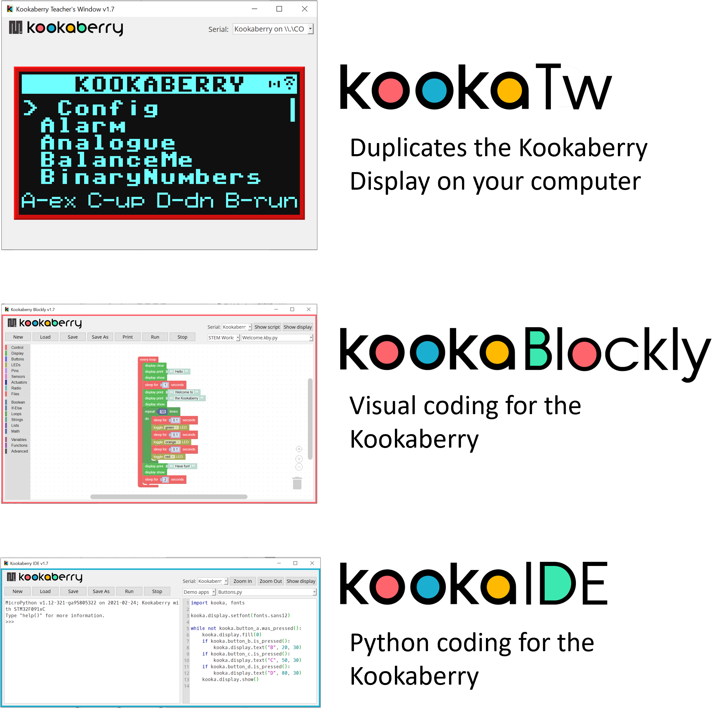
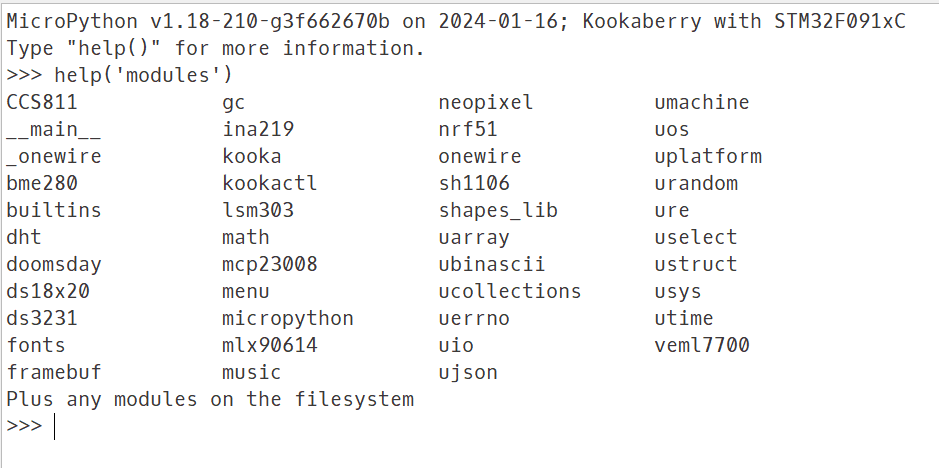
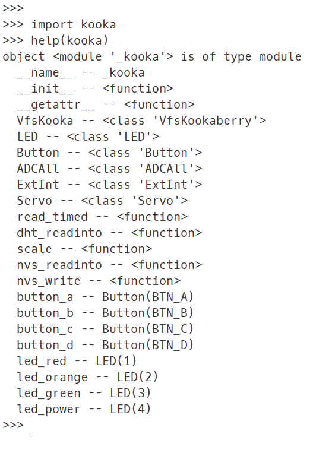
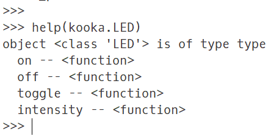

Kookaberry Software
===================

The **Kookaberry** is programmed using the **MicroPython** software language.  
This language is an implementation of the Python 3 language that has been adapted to be suitable for micro-computers.  

MicroPython
-----------

More information on **MicroPython** can be found at docs.micropython.org and in particular the **MicroPython** standard library at 
https://docs.micropython.org/en/latest/library/index.html#python-standard-libraries-and-micro-libraries 

**Micropython** source code is loaded as Python text files (``name.py``) onto the **Kookaberry’s** serial memory by a simple drag and drop operation 
when the **Kookaberry** is mounted as a USB drive on a computer.  

- **Kookaberry** scripts should be in the "/app" folder on the **Kookaberry** drive. 
- Libraries should be in the   "/lib" folder on the **Kookaberry** drive.  
- Data and plain text files should be in the base (root) of the **Kookaberry** drive. 
- Files created by **Kookaberry** scripts will also be stored in the base of the drive from where they can be retrieved.  

.. important:: 
    Please note that **Kookaberry**-generated files will not appear in the PC’s USB drive file directory until 
    after the **Kookaberry** has been dismounted and remounted as a USB drive. 
    The computer otherwise cannot detect the file changes that the **Kookaberry** makes.

The source code is converted to machine-readable bytecode by the **Kookaberry’s** on-board **MicroPython** compiler and will perform whatever instructions 
are contained in the source code.  This occurs when the program is run. 

Distinctively, the **Kookaberry** can also contain many **MicroPython** scripts (source code files) which can be selected and run by its on-board Menu.

Scripting Tools
---------------

**KookaSuite** is a set of script editing software tools for the **Kookaberry**.  

**KookaSuite** is available for Microsoft Windows, Apple’s MacOS, and the RaspberryPi Raspbian OS Personal Computers.
It comprises the following tools:

* For users who are more advanced and skilled in writing **MicroPython** scripts, the **KookaIDE** Interactive Development Environment (IDE) is included. 
  **KookaIDE** provides an interactive interface with the **Kookaberry** via the REPL interface (Read-Evaluate-Print-Loop), 
  which enables a live script coding and de-bugging interface for users.

* A second development environment is included which is intended for school students and coding novices called **KookaBlockly**.
  It is based on Google's Blockly drag and drop visual programming paradigm. 
  **KookaBlockly** automatically generates **MicroPython** code which is run in the usual manner.  

* **KookaTW** is a utility that mirrors the **Kookaberry** display on a USB-attached PC or Macintosh.  
  The **TW** stands for Twin, or alternatively Teacher's Window. 
  **KookaTW** is also built into the KookaIDE and **KookaBlockly** IDEs.  
  This facility allows the physically small Kookaberry display to be clearly observed and shared on a computer and makes it available 
  to screen-grabbing software for documentation purposes.

**KookaIDE**, **KookaBlockly** and **KookaTW** are all packaged as **KookaSuite** for Windows, Apple Macintosh, and Raspberry Pi Personal Computers. 
**KookaSuite** is available for download here: https://github.com/kookaberry/kooka-releases/tree/master/KookaSuite 

   Kookaberry Coding Tools

.. note::
  
  The **KookaBlockly Reference Guide** is available at this link: https://kookablockly-reference-guide.readthedocs.io/en/latest/

Kookaberry Firmware
-------------------

The Kookaberry contains low-level software that is stored in on-board non-volatile memory. 
Firmware performs basic low-level tasks to control and monitor the **Kookaberry**'s hardware, 
and to make it accessible to high-level software, such as MicroPython. 

Firmware updates may sometimes be issued that extend the functionality of the Kookaberry, or to remedy bugs in the firmware. 
The **Kookaberry’s** firmware is updated from time to time and the latest version may be downloaded from https://github.com/kookaberry/kooka-releases.

Instructions for firmware updates are provided on the GutHub page.  In general, follow this procedure:

1. Navigate into the Github firmware folder (https://github.com/kookaberry/kooka-releases/tree/master/firmware)
2. Then navigate into, depending on your model of Kookaberry, either the ``stm32`` folder (Kookaberry rev1-05 and rev1-06), 
   or the ``rp2040`` folder (Kookaberry v2 and later).
3. With the target Kookaberry connected via USB to your PC, download the various .bin files to the root folder of the **Kookaberry**'s file storage system.  
   The **Kookaberry**'s blue LED will flash during this process.  Wait until the blue LED is fully extinguished.  
4. Dismount the **Kookaberry** from your PC and disconnect it.
5. Reconnect the **Kookaberry** to your PC.  The blue LED will flash while the firmware is being updated.
6. The **Kookaberry** will then mount as a USB device with the new firmware operative.

Investigating Firmware Using REPL
---------------------------------

To see which modules are contained in the **Kookaberry**'s flash memory, use the **REPL** console window in **KookaIDE**.

Invoke the command: *help(‘modules’)* as is shown below:

   REPL dialogue for help('modules')

The response from the Kookaberry should be a list of modules as is shown.  
The module names run in alphabetic order in columns.  

To discover what is contained in any of the modules, import the module and invoke the command *help(module_name)* without quotes.
For example, *import kooka* and *help(kooka)* as shown below:

   REPL dialogue for help(kooka)

To investigate the object at a deeper level, say the class LED, invoke *help(kooka.LED)* using a dot (``.``) 
to define the hierarchical order of *module.item.subitem* etc.

   REPL dialogue for help(kooka.LED)

Each of the modules frozen into the Kookaberry’s flash memory are described in the following sections.

Kookaberry Specific Module Library
----------------------------------

Modules for using functions that are unique to the **Kookaberry** are are described below:

.. toctree:: 
    :maxdepth: 2

    kooka.rst
    machine.rst

