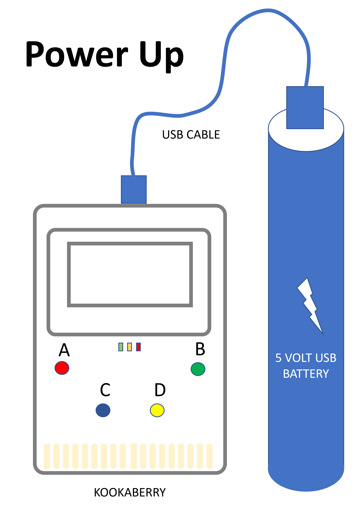

Using the Kookaberry
====================

Using the **Kookaberry** is relatively simple and as described below.

Power-up
--------

The simplest way to power-up the **Kookaberry** is to connect its USB connector to a charged USB battery.

.. _powerup:

   Connecting a USB battery

Alternatively, connect a compatible battery pack to the **Kookaberry's** 2-pin power connector and switch the pack on.

A green LED on the back of the Kookaberry should illuminate.  If you see a slowly pulsing blue LED then the battery voltage is too low.  
Charge or replace the battery and try again.

If no LED lights then the battery is not connected, or not switched on, or is completely flat. 
Check that 

* the battery cable is completely plugged in
* the cabling and plugs are not damaged
* any battery pack switch is on
* that the battery packs are charged

Menu Start-up
-------------

The **Kookaberry** has an in-built menu for running scripts that are stored in the **Kookaberry**'s file storage.

Follow the procedure in the infographic below.

.. _startup:

   Starting the Kookaberry's inbuilt menu

Any MicroPython scripts that are stored in the **Kookaberry**'s app folder will be listed and available to be run.

Programming
-----------

To code **MicroPython** scripts, use one of the **KookaSuite** programming tools.

First connect the Kookaberry to a USB port on a personal computer which has **KookaSuite** installed.

The Kookaberry should be recognised as a USB drive.

Launch **KookaBlockly** or **KookaIDE** and write your script, or load a script already written from your Kookaberry Scripts folder.

Click on the Run button in the **KookaSuite** tool to transfer the program to the Kookaberry and run it.

.. _coding:

.. figure:: images/coding-infographic.png
   :width: 80%
   :align: center

   Coding the Kookaberry

Your script can be made to appear in the **Kookaberry**'s menu by copying the script (or saving it using Save-As) into the **Kookaberry**'s app folder.